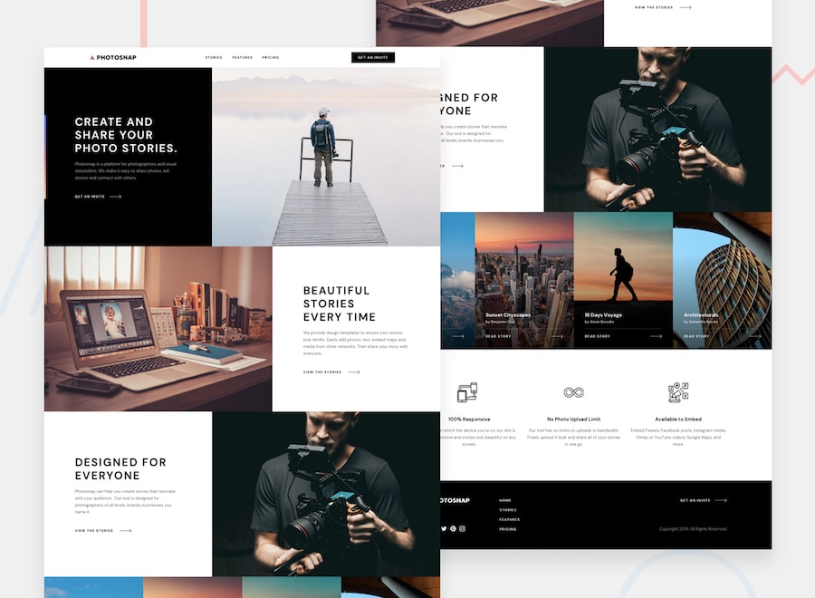

# Frontend Mentor - Photosnap Website solution

This is a solution to the [Photosnap Website challenge on Frontend Mentor](https://www.frontendmentor.io/challenges/photosnap-multipage-website-nMDSrNmNW). Frontend Mentor challenges help you improve your coding skills by building realistic projects. 

## Table of contents

- [Overview](#overview)
  - [The challenge](#the-challenge)
  - [Screenshot](#screenshot)
  - [Links](#links)
- [My process](#my-process)
  - [Built with](#built-with)
- [Author](#author)

**Note: Delete this note and update the table of contents based on what sections you keep.**

## Overview

### The challenge

Users should be able to:

- View the optimal layout for each page depending on their device's screen size
- See hover states for all interactive elements throughout the site

### Screenshot

### Links

- Live Site URL: [Add live site URL here](https://photosnap-beryl.vercel.app/)

## My process
  I was a little ill prepared for this project.
  I jumped right into it with little planning, it was no problem to get my final solution. However, I do believe that I can improve my code quality and be more clean in the future. I already created a list that I'll be using in future projects, to plan and prepare as one should to improve your development, in my opinion.
  
### Built with

- Semantic HTML5 markup
- CSS custom properties
- Flexbox
- CSS Grid
- [React](https://reactjs.org/) - JS library

## Author

- Website - [Corrie Graham](https://www.your-site.com)
- Frontend Mentor - [@CorrieGra](https://www.frontendmentor.io/profile/CorrieGra)
